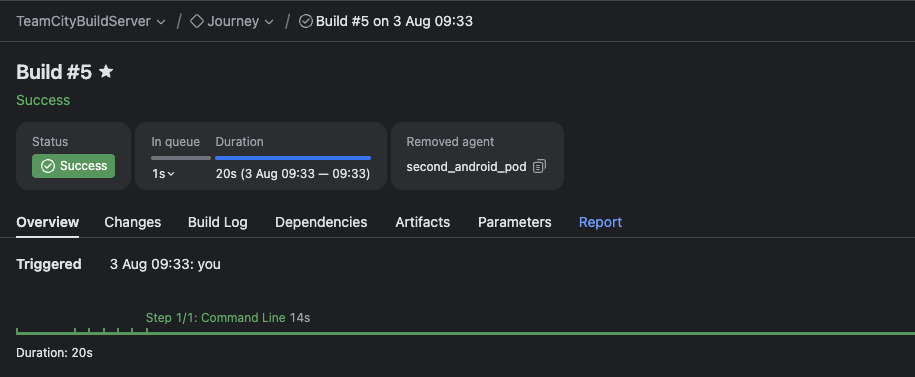

<div align="center">
<pre>
     _         _                        _           _   _____ ____  _____   _____         _   _               ____  _       _    __                      
    / \  _   _| |_ ___  _ __ ___   __ _| |_ ___  __| | | ____|___ \| ____| |_   _|__  ___| |_(_)_ __   __ _  |  _ \| | __ _| |_ / _| ___  _ __ _ __ ___  
   / _ \| | | | __/ _ \| '_ ` _ \ / _` | __/ _ \/ _` | |  _|   __) |  _|     | |/ _ \/ __| __| | '_ \ / _` | | |_) | |/ _` | __| |_ / _ \| '__| '_ ` _ \ 
  / ___ \ |_| | || (_) | | | | | | (_| | ||  __/ (_| | | |___ / __/| |___    | |  __/\__ \ |_| | | | | (_| | |  __/| | (_| | |_|  _| (_) | |  | | | | | |
 /_/   \_\__,_|\__\___/|_| |_| |_|\__,_|\__\___|\__,_| |_____|_____|_____|   |_|\___||___/\__|_|_| |_|\__, | |_|   |_|\__,_|\__|_|  \___/|_|  |_| |_| |_|
                                                                                                      |___/                                              
</pre>
<h1>with TeamCity Integration</h1>
</div>

---

## TeamCityBuildServer

This project is intended to showcase how TeamCity can be used to create, schedule, run and interpret **e2e tests** (from now on referred to as **Journeys**) of any web or mobile-native application but also any Api, 
and obtain valuable data at the end in the form of a concentrated report that provides data about every step of the test.
## Video Demo (for a very quick showcase of the core platform functionality, skip to [16:49](https://youtu.be/oVDdIOgKE9s?t=1010)) :
[](https://youtu.be/oVDdIOgKE9s)
## Features
* Teamcity is used to provide the UI, scheduling, failure conditions, performance monitoring and many more ...
* Teamcity [server](https://hub.docker.com/r/jetbrains/teamcity-server/tags) and the agents are completely dockerized, one host machine/cloud VM can host multiple tc agents
* [CodeGen](https://github.com/Teoneag/codegen.git) is used to generate : 
   * Web journeys with PlayWright code generation 
   * Mobile journeys with Appium Inspector for Android/Ios
   * Api journeys
* [WebPagesInTeamCityPlugin](https://github.com/ChiriacCasian/WebpagesInTeamCityPlugin.git) is a custom TeamCity Plugin used to inject the UI of the CodeGen into the UI of TeamCity
* [JourneyExecutor](https://github.com/ChiriacCasian/pod-infra_v2.git) contains the journey running and report generation logic (in kotlin DSL), it is added as a custom buildConfiguration and automatically packaged and provided to journeys on every commit \ 
as a runnable, so it is straightforward and convenient to change the journey running logic  
* All journeys implement the JourneyTemplate, easily extend journey logic/parameters/dependencies
* Agents use custom [image](https://hub.docker.com/repository/docker/chiriaccasian123/teamcity-e2e-agent) with an env setup to enable running the journeys
---

### Journey Workflow

1. **Configuration & Creation**
    Configure the Parameters of the Journey you want to run.
    ```
    env.JOURNEY_NAME        -> Must Unique per subproject, create subprojects and create the journey name: $subprojectName_JourneyName 
    env.JOURNEY_TYPE        -> Recommended types : "WEB, ANDROID, IOS", the journey can have any type, as long as the agent/agents meant to run it have compatibility set with that type
    ```
    
    Click on the 'run' button and, when prompted, click on the 'Click here to create journey!' \
    With Web Recording you can create a journey on a website.
    With Mobile Recording you can create a journey on an Android/Ios device, just make sure to configure the desired device in the CodeGen server.
    With Api Recording you can test an API by providing a request and a desired response.
    You can Chain different recordings in any way possible, Web -> Mobile -> Web -> Web -> API -> etc..
    After you have finished the recordings, press 'Save' to finnish the journey creation process.


2. **Triggers and Scheduling**  
Easily configure how often and when the Journey should be executed via the build in Teamcity scheduling:
https://www.jetbrains.com/help/teamcity/builds-schedule.html
https://www.jetbrains.com/help/teamcity/configuring-schedule-triggers.html

Use Cron expression to schedule precisely: 


3. **Failure Conditions**  
Set execution timeouts for a Journey and any other custom Failure Condition via the build in teamcity UI: 
https://www.jetbrains.com/help/teamcity/build-failure-conditions.html


4. **Reports** \
After the Journey has finished execution a report is generated by the JourneyExecutor, it can be found in the artifact of \
that journey run or in the Report tab.

---

## Setup
### 1. TeamCity Server
Inside this project:
```bash
docker compose up --build
```
Inside the teamcity UI that opens at the default address 'http://localhost:8111' configure the project-global parameters :
```
GIT_AUTH_TOKEN                         -> your git PAT token with the appropriate permissions (TC server needs to be able to read JourneyExecutor repo and read/write your clone of this repo)
GIT_USER                               -> your git username
JOURNEY_EXECUTOR_GIT_ADDRESS           -> git address of where your clone of the JourneyExecutor repository is hosted
TC_AUTH_TOKEN                          -> obtained by going to your admin account's bottom left acount icon -> profile -> Access Tokens -> create access token
TC_BUILDSERVER_GIT_ADDRESS             -> git address of where your clone of this repository is hosted 
```

Add these internal properties, configure them with the address of the CodeGen frontend:
```
teamcity.web.header.Content-Security-Policy.protectedValue=frame-src 'self' <ADDRESS OF CODEGEN FRONTEND>
teamcity.web.header.Content-Security-Policy.adminUI.protectedValue=frame-src 'self' <ADDRESS OF CODEGEN FRONTEND> 
```

Disable artifact domain isolation, or set [up custom url to serve the artifacts for increased security](https://www.jetbrains.com/help/teamcity/2025.07/teamcity-configuration-and-maintenance.html?Artifacts+Domain+Isolation#artifacts-domain-isolation).

### 2. Agents and Agents Host Machine
Simply pull the docker [image](https://hub.docker.com/repository/docker/chiriaccasian123/teamcity-e2e-agent), configure parameters (according to docs) and run it in a container.  
*Host must be macOS (otherwise it will not be able to run iOS pods). If iOS journeys are not important the host can be any OS.*

#### For Android / iOS agents, set up the agent's host machine:
The end goal is to have an Appium server running on the host machine on the default port 4723, and the devices findeable via
```bash
adb devices
```
1. **Install Appium**
   ```bash
   brew install appium
   ```
2. **Install Appium Driver**
    ```bash
    appium driver install uiautomator2
    ```
3. **Install Android Studio**
   ```bash
   brew install android-studio
   ```

#### 2.1 *(Just for iOS)* **Validate Xcode license**

1. **Install Xcode** from the Mac App Store, then run Xcode once to accept the licence.
2. **Log in with your AppleID** – *Xcode ▸ Settings ▸ Accounts ▸ “+” ▸ AppleID*.
3. **Install the Appium iOS driver**
   ```bash
   appium driver install xcuitest
   ```
4. **Trust your developer certificate on the device** – *Settings ▸ VPN & Device Management ▸ Developer App ▸ Trust*.
5. **Locate the device UDID**
   ```bash
   xcrun xctrace list devices
   ```

> **Note on iOS17+ / Xcode15**  
> WebDriverAgent must be signed (only business Apple accounts can control iOS devices with WebDriverAgent). A quick way to verify: *Xcode ▸ Window ▸ Devices & Simulators* → choose device → *Open Console* and look for signing errors when running WDA (build, then `⌃U`).

3. **Start Device and Verify**  
   Get the UUID for configuring the agent.
   ```bash
   adb devices
   ```

### 3. Phones setup (Only if setting up for Android/Ios journeys)

#### Android
1. **Enable Developer Options** – *Settings ▸ About phone ▸ Build number → tap 7 times*.
2. **Enable USB Debugging** – *Settings ▸ Developer options ▸ USB Debugging*.
3. **Stay awake** – enable *Stay awake while charging*.

#### iOS
1. **Enable Developer Mode** (iOS16+) – *Settings ▸ Privacy & Security ▸ Developer Mode* → reboot → enable.
2. **Trust the Mac** when prompted on first USB connection.
3. **Keep screen awake** – *Settings ▸ Display & Brightness ▸ Auto-Lock ▸ Never*.
4. **To CLI-start the WebDriverAgent on multiple iOS devices:**  
   First `cd` into the directory with `WebDriverAgent.xcodeproj` (for example `~/.appium/node_modules/appium-xcuitest-driver/node_modules/appium-webdriveragent`).  
   Under `-destination` list the IDs of the iOS devices you want to start WebDriverAgent on.
   ```bash
   xcodebuild \
     -project WebDriverAgent.xcodeproj \
     -scheme    WebDriverAgentRunner \
     test \
     -destination 'id=73782d41234e22c7dcbc4a64ad478c072b834dd9' \
     -destination 'id=00008120-001849603E98C01E'
   ```

---

### 4. CodeGen and WebpagesInTeamCityPlugin

The [**CodeGen**](https://github.com/Teoneag/codegen.git) repository contains two runtimes:

* The **.js backend server**, which generates the actual **.py script** used to replicate the journey on every run.
* The **Angular frontend**, which allows configuration of the journey steps.

This UI is injected via the [**WebpagesInTeamCityPlugin**](https://github.com/ChiriacCasian/WebpagesInTeamCityPlugin.git), which needs to be packaged and added via **TC UI → Admin → Plugins**.

Since the TC server needs to display the CodeGen frontend and then fetch the generated script from the CodeGen backend server, both must be provided as environment variables to the Journey Generator:
```
env.CODEGEN_FRONTEND_URL 
env.CODEGEN_SERVER_URL
```

---

## Limitations

### Multiple Appium servers (one per physical / emulated device)

Bind an Appium server to a specific port and device UUID:
```bash
appium server
--port 
--default-capabilities '{ "platformName": "iOS", "appium:automationName": "xcuitest" }'
configurable
configurable
``` 
Advantages:
* Fault tolerance – reduces the risk of losing control over all devices connected to a host.
* Load distribution – less stress on each individual Appium server.

### One Appium server for all devices
Inject the device UUID into the script before running it (via an env variable).  
Appium can control multiple devices in parallel: <https://appium.readthedocs.io/en/latest/en/advanced-concepts/parallel-tests/>  
If crashes become frequent, switch to the one-server-per-device approach.

### Why the mobile phone *Emulator* cannot be containerized
* Google only ships the Android emulator for x86-64 Linux, not for the ARM64 architecture used by Apple-Silicon Macs.
* Running that x86-64 binary inside an ARM-based Docker container on macOS triggers Rosetta and fails with:  
  `rosetta error: failed to open elf at /lib64/ld-linux-x86-64.so.2`.
* macOS lacks the KVM hardware-virtualisation features the emulator relies on.

### Why the Appium Server (iOS) cannot be containerized
* iOS automation requires **Xcode’s WebDriverAgent**, which will only sign & run on a macOS host that trusts the certificate.
* No macOS images are available for Docker (due to Apple licensing), therefore the Appium server controlling iOS **must** run on the host.
* For Android journeys it *is* possible to run Appium inside the container; however `adb` still runs on the host, so the container needs network access to `host.docker.internal`.

---

## Dictionary
* **Journey**: A package containing an e2e test and all of its configuration data.
* **Journey Run**: A unitary instance of a journey which is running/ran and produces a report.
